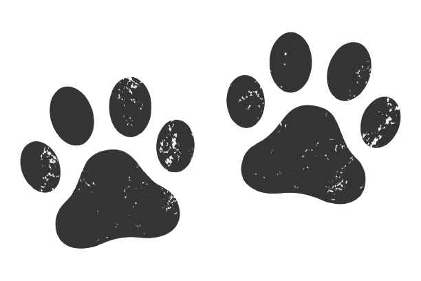

<<<<<<< HEAD
You said:

<!DOCTYPE html>
<html lang="en">
  <head>
    <meta charset="UTF-8" />
    <meta name="viewport" content="width=device-width, initial-scale=1.0" />
    <link rel="preconnect" href="https://fonts.googleapis.com" />
    <link rel="preconnect" href="https://fonts.gstatic.com" crossorigin />
    <link
      href="https://fonts.googleapis.com/css2?family=Amatic+SC:wght@400;700&display=swap"
      rel="stylesheet"
    />
    <link rel="stylesheet" href="styles.css" />
    <title>Card-game</title>
  </head>
  <body>
    <header>
      <h1>A game for Cat lovers</h1>
      
    </header>
    <main>
      

      

      

      

      

      

      

      

      

      

      

      

      

      

      

      

    </main>
    
  </body>
</html> * {
  margin-top: 0px;
}
h1 {
  font-family: "Amatic SC", sans-serif;
  font-weight: 700;
  font-style: normal;
  font-size: 3rem;
}

header {
display: flex;
justify-content: center;
align-items: center;
gap: 10px;
}
main .item {
height: 180px;
width: 130px;
background-color: bisque;
border: 1.5px solid black;
}
main {
display: grid;
grid-template-columns: repeat(8, 1fr); /_ 4 columns _/
gap: 20px;
justify-items: center;
margin: 40px auto;
}
main img {
height: 50px;
display: block;
margin: 60px auto;
}
so i have made this UI for a game that i am making so i was thinking if i should add this ui in github? and then oull it whn i am adding javascript?

ChatGPT said:
Yes, you should absolutely add this UI to GitHub now — it's a great idea, and here's why:

✅ Benefits of Adding It Now
Version Control
You’ll be able to track your progress. Any future changes (like adding JavaScript) will be easy to manage and undo if needed.

Backup
It’s safe on GitHub in case anything happens to your local files.

Professional Habit
It's standard practice in the industry to push early and update frequently. It shows good project management skills.

Easy Collaboration (if needed later)
Even if you're working solo, having everything structured helps you or others understand the project history.

🧠 Suggested Folder Structure Before Pushing
Just make sure you have a clean project folder like this:

matlab
Copy
Edit
cat-game/
├── index.html
├── styles.css
├── index.js
└── assets/
├── heading cat.jpg
└── paws.png
🛠️ What You Should Do Next
Initialize Git (only once in your project folder):

bash
Copy
Edit
git init
git add .
git commit -m "Initial commit: UI for cat game"
Create a GitHub Repo (via the GitHub website).

Link your local folder to GitHub and push:

bash
Copy
Edit
git remote add origin https://github.com/your-username/cat-game.git
git branch -M main
git push -u origin main
Later, when you add JavaScript, just:

bash
Copy
Edit
git add .
git commit -m "Add game logic"
git push
Let me know if you want help with the .gitignore, writing a README, or deploying it live later with GitHub Pages!

You said:
okayy! on it

ChatGPT said:
Awesome! 🎉 Let me know when you're ready to:

Write a catchy README.md

Add game logic in JavaScript

Style the game board more

Or even deploy it with GitHub Pages (so your friends can play it online!)

You’ve got a great start — keep going! 🐾💻

You said:
what to add on description and read me

ChatGPT said:
Great question! A well-written README.md makes your project look polished and professional — even if it's just a fun game. Here's a quick guide tailored to your cat game project 🐱🎮:

✅ Minimal Description (for GitHub repo)
🎮 A cute card-matching memory game for cat lovers

You said:
wait but i still dont know how to push with read me file cold u helo with that?

ChatGPT said:
Absolutely! Here's how to create a README file and push it to GitHub — step by step:

📝 Step 1: Create a README.md File
In your project folder, make a file called README.md (you can do this in VS Code):

Right-click → New File → README.md

Paste this starter content:

markdown
Copy
Edit

# 🐾 Cat Lovers Memory Game

A fun and adorable card-matching memory game for cat lovers!  
Flip the paw cards to find matching cats hidden behind them.

## 🎯 Features

- 8 unique cat pairs
- Simple, clean UI
- Built with HTML, CSS, and JavaScript

## 🚧 Status

UI completed ✅  
Game logic coming soon 🛠️

## 📸 Screenshot

_Add a screenshot here later_

## 🛠️ Tech Used

- HTML5
- CSS3
- JavaScript (soon!)

## ✨ Inspiration

Made with love by a cat lover 💛
=======
# Card-game-UI
UI of a memory game for cat lovers — match the paws to reveal the hidden cats!
>>>>>>> dc1740d6a72c9998b2aea575fee3ac2e1a57e149
